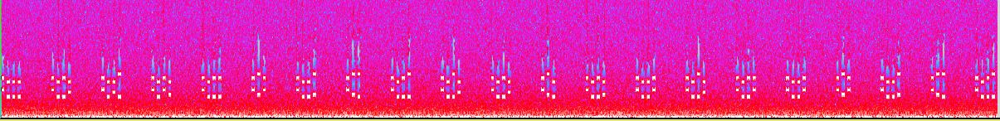

# Internetwache 2016 : Crypto (80)

**Category:** crypto |
**Points:** 80 |
**Name:** Procrastination |
**Solves:** 74 |
**Description:**

> Watching videos is fun! Hint: Stegano skills required.
>
> Link: 
> https://procrastination.ctf.internetwache.org

___

## Write-up

We got rick rolled by the website link. It gave us a 30 second webm video from Rick Astley's Never Gonna Give You Up.

We did not find any problems with the main video or audio, but we noticed there was a secondary audio track. The secondary audio track 
We ran the track in Audacity's Spectrum view, and it showed:

We realized that these were telepone keypad tones, and we converted them into numbers:

0111 0127 0173 0104 0122 060 0116 063 0123 0137 0127 061 0124 0110 0137 0120 0110 060 0116 063 0123

which looked like octal numbers, so we converted them into text:

IW{DR0N3S_W1TH_PH0N3S}