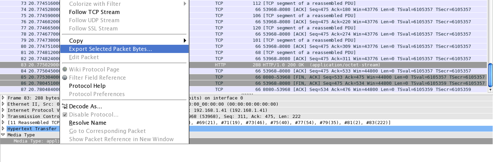

# Internetwache 2016 : 404 Flag not found (misc70)

**Category:** misc |
**Points:** 70 |
**Name:** 404 Flag not found |
**Solves:** 454 |
**Description:**

> Sniffing traffic is fun. I saw a wired shark. Isn't that strange?
>
> Attachment: [misc70.zip](src/misc70.zip)

___

## Write-up

### Part One
Unzipping the package given to us we get a readme with
```
The shark won't bite you. Don't worry, it's wired!
```

and a gzipped pcap.

Throwing the pcap onto wireshark, we see three sets of conversations between the server itself (192.168.1.41 to 192.168.1.41).
First GET request was responded with an HTTP 401 UNAUTHORIZED error, and the second and third was responded with a HTTP 200 OK error.


Going into the follow TCP Stream of the second request, we find that a html page with two files (flag.txt and flag.zip) is transferred between the server and the client.
Believe these are the files we are looking for :)


### Part two
Looking into the next request/response the actually file (flag.zip) is being sent via a **application/octet-stream**

We then extract this file via **Export Selected Packet Bytes...** as a .zip file.



### Part three
Opening this zip archive, we are met with a password lock.


Trying out all the strings (including the readme) doesn't seem to work, so we went back into the pcap, and found that the authorization token that caused the second and third request to be OK was the password we were looking for in base64.


Converting that back into ascii gave us this:
```
flag:azulcrema
```

Using **azulcrema** to unlock the zip, gave us our flag.txt ^.^
```
IW{HTTP_BASIC_AUTH_IS_EASY}
```
