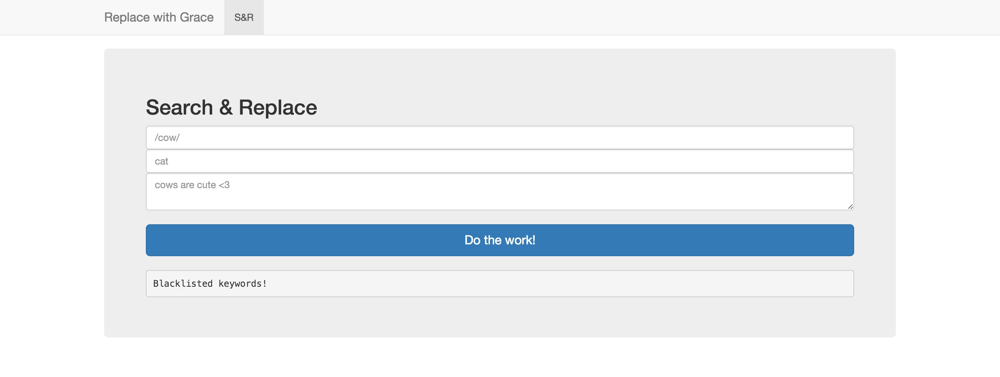

# Internetwache 2016 : Replace with Grace (web60)

**Category:** web |
**Points:** 60 |
**Name:** Replace with Grace |
**Solves:** 268 |
**Description:**

> Regular expressions are pretty useful. Especially when you need to search and replace complex terms.
>
> Service: https://replace-with-grace.ctf.internetwache.org/

___

## Write-up

### Part One
Entering into the page, we are met with three fields which we assumed represented the **preg_match** function in php (it's a html page hosted on a web server, so why not assume its just php).



Looking for exploits on php preg_match, we came across [this page](http://www.madirish.net/402).

Seems like using **/(.*)/e** as the regex, will cause php to eval the second parameter literally.

### Part Two
Second part was to list all files in the directory using php and we were able to find there was a **flag.php**. Seems fishy right???

Directory listing was done through scandir() which returned an array.

Another method to list a directory (and probably faster was to execute a bash command:


### Part Three
Final step was to open **flag.php** which was more troublesome than we thought.

Trying to run any php file stream related commands we get the following:


So we figured to just use bash's cat


And that gave us the flag ^.^
```
IW{R3Pl4c3_N0t_S4F3}
```
